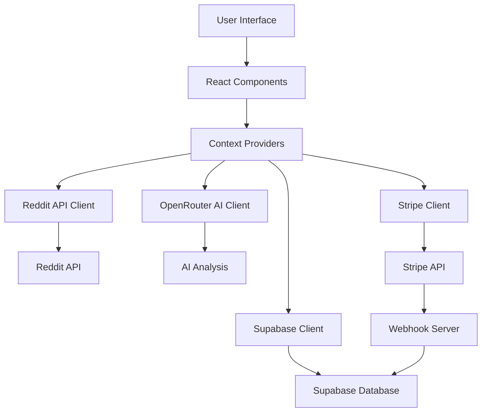
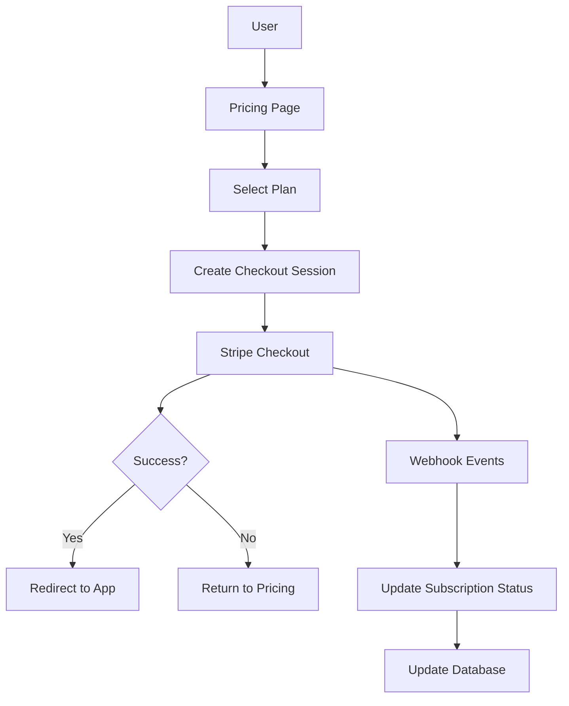
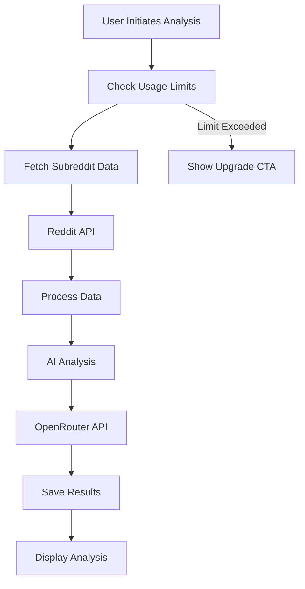
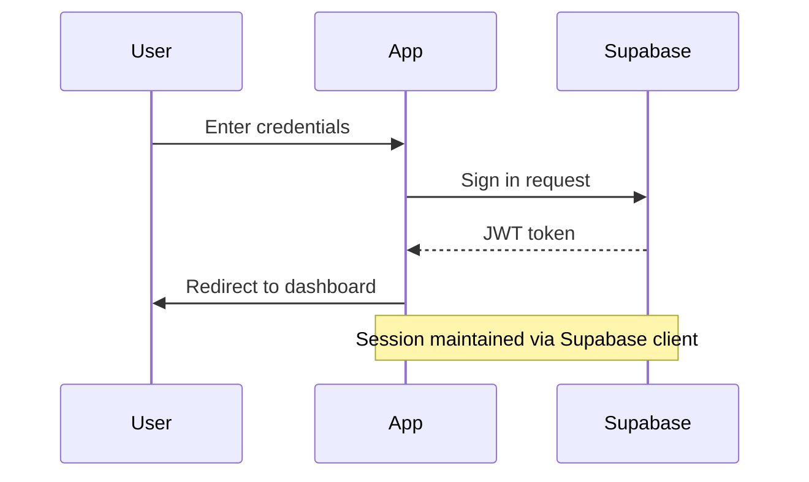
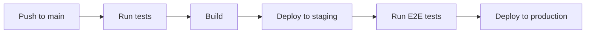

# SubPirate Documentation

## Table of Contents
1. [Overview](#overview)
2. [Architecture](#architecture)
3. [Features](#features)
4. [Technical Stack](#technical-stack)
5. [Authentication](#authentication)
6. [Database Schema](#database-schema)
7. [API Integration](#api-integration)
8. [Subscription System](#subscription-system)
9. [Webhook Processing](#webhook-processing)
10. [Components](#components)
11. [State Management](#state-management)
12. [API Routes](#api-routes)
13. [Security Features](#security-features)
14. [Usage Tracking](#usage-tracking)
15. [Deployment](#deployment)
16. [Development Guide](#development-guide)
17. [Testing Strategy](#testing-strategy)
18. [Troubleshooting](#troubleshooting)
19. [Performance Optimizations](#performance-optimizations)
20. [Future Development](#future-development)

## Overview

SubPirate is a Reddit marketing analysis tool that helps users discover, analyze, and manage marketing opportunities across different subreddits. The application provides AI-powered insights, engagement metrics, and project management features for coordinating marketing efforts across multiple subreddits.

### Key Features
- Subreddit analysis with AI-powered insights
- Project management for organizing marketing campaigns
- Team collaboration with role-based access
- Saved subreddits list for quick access
- Detailed analytics and recommendations
- Content strategy planning
- Subscription model with different tiers
- Usage tracking and limitations

## Architecture

The application follows a modern React-based architecture with the following key components:

```
src/
├── app/         # App-specific configuration and providers
├── components/  # Reusable UI components
├── contexts/    # React context providers
├── features/    # Feature-specific components and logic
│   ├── subreddit-analysis/
│   ├── project-management/
│   └── subscription/
├── hooks/       # Custom React hooks
├── lib/         # Core business logic and API integrations
│   ├── api/     # API integration
│   ├── stripe/  # Stripe integration
│   └── utils/   # Utility functions
├── pages/       # Main application pages/routes
└── workers/     # Web workers for background processing
```

### Data Flow


### Subscription Flow


### Analysis Flow


## Features

SubPirate offers a range of powerful features designed to enhance Reddit marketing strategies:

### Subreddit Analysis
- AI-powered analysis of subreddit rules and content
- Marketing-friendliness score calculation
- Posting requirements identification
- Best practices recommendations
- Ideal posting times and frequency

### Project Management
- Create and organize marketing campaigns
- Add subreddits to projects
- Track performance across multiple subreddits
- Set goals and track progress

### Team Collaboration
- Share projects with team members
- Role-based access control (read, edit, owner)
- Activity tracking
- Collaborative workspace

### Saved Subreddits
- Quick access to frequently used subreddits
- Custom notes and tags
- Last post tracking
- Sorting and filtering options

### Analytics Dashboard
- Performance metrics visualization
- Engagement tracking
- Content performance analysis
- Trend identification

### Content Strategy
- Title template generation
- Content type recommendations
- Posting schedule optimization
- A/B testing suggestions

## Technical Stack

### Frontend
- **Framework**: React 18.3.1 with TypeScript 5.5.3
- **Routing**: React Router 6
- **State Management**: React Query + Local State
- **Styling**: TailwindCSS 3.4.1
- **Forms**: React Hook Form
- **Data Visualization**: Chart.js + React Chart.js 2
- **Icons**: Lucide React
- **Build Tool**: Vite 5.4.2

### Backend
- **Platform**: Supabase (Database & Auth)
- **Database**: PostgreSQL
- **Authentication**: Supabase Auth
- **Storage**: Supabase Storage
- **Functions**: PostgreSQL functions
- **Real-time**: Supabase Realtime

### External Services
- **Reddit API**: REST API for Reddit data
- **OpenRouter AI API**: AI analysis (using deepseek/deepseek-chat model)
- **Stripe API**: Payment processing and subscription management
- **Stripe Webhooks**: Separate Express.js server for event handling

### Development Tools
- **Type Safety**: TypeScript
- **Linting**: ESLint
- **Testing**: Jest (unit testing), Playwright (E2E testing)
- **Package Management**: npm
- **Version Control**: Git
- **CI/CD**: GitHub Actions
- **Code Formatting**: PostCSS, Autoprefixer

## Authentication

Authentication is handled through Supabase Auth with the following features:

- Email/Password authentication
- Session management
- Protected routes
- Role-based access control

### Auth Flow


### Implementation Details

- **JWT-based authentication**: Secure, stateless tokens for authentication
- **Session management**: Handled via Supabase client
- **Protected routes**: Routes requiring authentication are wrapped in a `PrivateRoute` component
- **Role-based access**: Different permission levels (read, edit, owner) for project sharing
- **Subscription-based feature access**: Feature availability controlled by subscription tier

### Code Example: PrivateRoute Component

```typescript
function PrivateRoute({ children }: { children: React.ReactNode }) {
  const { user, loading } = useAuth();

  if (loading) {
    return <div>Loading...</div>;
  }

  if (!user) {
    return <Navigate to="/login" />;
  }

  return (
    <div className="flex">
      <Sidebar />
      <main className="flex-1 p-8">
        {children}
      </main>
    </div>
  );
}
```

## Database Schema

### Core Tables

#### profiles
- `id` (uuid, PK) - References auth.users
- `display_name` (text)
- `email` (text)
- `image_url` (text)
- `created_at` (timestamptz)
- `updated_at` (timestamptz)
- `stripe_customer_id` (text)
- `full_name` (text)

#### projects
- `id` (uuid, PK)
- `user_id` (uuid, FK)
- `name` (text)
- `description` (text)
- `image_url` (text)
- `created_at` (timestamptz)
- `updated_at` (timestamptz)

#### project_members
- `id` (uuid, PK)
- `project_id` (uuid, FK)
- `user_id` (uuid, FK)
- `role` (enum: 'read', 'edit', 'owner')
- `created_at` (timestamptz)
- `updated_at` (timestamptz)

#### subreddits
- `id` (uuid, PK)
- `name` (text)
- `subscriber_count` (integer)
- `active_users` (integer)
- `marketing_friendly_score` (integer)
- `posting_requirements` (jsonb)
- `posting_frequency` (jsonb)
- `allowed_content` (text[])
- `best_practices` (text[])
- `rules_summary` (text)
- `title_template` (text)
- `icon_img` (text)
- `community_icon` (text)
- `total_posts_24h` (integer)
- `analysis_data` (jsonb)
- `last_analyzed_at` (timestamptz)
- `last_post_sync` (timestamptz)
- `created_at` (timestamptz)
- `updated_at` (timestamptz)

#### project_subreddits
- `id` (uuid, PK)
- `project_id` (uuid, FK)
- `subreddit_id` (uuid, FK)
- `created_at` (timestamptz)

#### saved_subreddits
- `id` (uuid, PK)
- `user_id` (uuid, FK)
- `subreddit_id` (uuid, FK)
- `created_at` (timestamptz)
- `last_post_at` (timestamptz)

### Stripe Integration Tables

#### stripe_products
- `id` (uuid, PK)
- `stripe_product_id` (text, unique)
- `name` (text)
- `description` (text)
- `active` (boolean)
- `metadata` (jsonb)
- `created_at` (timestamptz)
- `updated_at` (timestamptz)

#### stripe_prices
- `id` (text, PK)
- `active` (boolean)
- `currency` (text)
- `unit_amount` (integer)
- `type` (text)
- `recurring_interval` (text)
- `stripe_product_id` (text, FK)
- `created_at` (timestamptz)
- `updated_at` (timestamptz)

#### customer_subscriptions
- `id` (uuid, PK)
- `user_id` (uuid, FK)
- `stripe_customer_id` (text)
- `stripe_subscription_id` (text)
- `stripe_price_id` (text)
- `status` (subscription_status enum)
- `trial_start` (timestamptz)
- `trial_end` (timestamptz)
- `current_period_start` (timestamptz)
- `current_period_end` (timestamptz)
- `cancel_at_period_end` (boolean)
- `created_at` (timestamptz)
- `updated_at` (timestamptz)

### Usage Tracking Tables

#### user_usage_stats
- `id` (uuid, PK)
- `user_id` (uuid, FK)
- `subreddit_analysis_count` (integer)
- `month_start` (timestamptz)
- `month_end` (timestamptz)
- `created_at` (timestamptz)
- `updated_at` (timestamptz)

#### reddit_api_usage
- `id` (uuid, PK)
- `reddit_account_id` (uuid, FK)
- `endpoint` (text)
- `endpoint_hash` (varchar(32))
- `requests_count` (integer)
- `window_start` (timestamptz)
- `reset_at` (timestamptz)
- `updated_at` (timestamptz)
- `created_at` (timestamptz)

### Row Level Security (RLS)

All tables have RLS enabled with appropriate policies for security:

#### Projects
```sql
-- View own projects
CREATE POLICY "view_own_projects"
  ON projects FOR SELECT
  TO authenticated
  USING (user_id = auth.uid());

-- Create projects
CREATE POLICY "create_projects"
  ON projects FOR INSERT
  TO authenticated
  WITH CHECK (user_id = auth.uid());

-- Update own projects
CREATE POLICY "update_own_projects"
  ON projects FOR UPDATE
  TO authenticated
  USING (user_id = auth.uid());

-- Delete own projects
CREATE POLICY "delete_own_projects"
  ON projects FOR DELETE
  TO authenticated
  USING (user_id = auth.uid());
```

#### Project Members
```sql
-- View project members
CREATE POLICY "view_project_members"
  ON project_members FOR SELECT
  TO authenticated
  USING (
    EXISTS (
      SELECT 1 FROM projects
      WHERE id = project_members.project_id
      AND user_id = auth.uid()
    )
  );

-- Manage project members
CREATE POLICY "manage_project_members"
  ON project_members FOR ALL
  TO authenticated
  USING (
    EXISTS (
      SELECT 1 FROM projects
      WHERE id = project_members.project_id
      AND user_id = auth.uid()
    )
  );
```

## API Integration

### Reddit API
The application uses a custom Reddit API client (`src/lib/redditApi.ts`) that handles:
- Authentication with Reddit's API
- Rate limiting and retries
- Error handling
- Data transformation

Key Reddit API endpoints used:

- `/r/{subreddit}/about.json` - Subreddit information
- `/r/{subreddit}/hot.json` - Hot posts for analysis
- `/r/{subreddit}/about/rules.json` - Subreddit rules
- `/subreddits/search.json` - Subreddit search functionality

### OpenRouter AI
AI analysis is performed using the OpenRouter API (`src/lib/openRouter.ts`):
- Model: deepseek/deepseek-chat
- Custom system prompts for marketing analysis
- Structured output format
- Error handling and retries

The AI analysis provides:
- Content pattern detection
- Rule interpretation
- Marketing strategy recommendations
- Optimal posting times
- Title formats that perform well

### Stripe Integration

Payment processing is handled through Stripe's API:

- **Checkout sessions**: Securely process payments
- **Subscription management**: Handle recurring billing
- **Webhook processing**: Track subscription lifecycle events
- **Customer portal**: Self-service subscription management

## Subscription System

SubPirate offers a tiered subscription model with different feature sets and usage limits.

### Subscription Tiers

1. **Starter Tier** - $19.99/month
   - Target: Individual users and small projects
   - Limited subreddit analysis (10/month)
   - Basic analytics

2. **Creator Tier** - $39.99/month
   - Target: Content creators and small businesses
   - Expanded subreddit analysis (50/month)
   - Advanced analytics

3. **Pro Tier** - $47.99/month
   - Target: Professional marketers
   - Unlimited subreddit analysis
   - Team collaboration features
   - Advanced reporting

4. **Agency Tier** - $97.99/month
   - Target: Marketing agencies and large teams
   - Full platform access
   - Multiple team workspaces
   - Premium support

### Subscription Management

- **Stripe Checkout**: Secure payment processing
- **Customer Portal**: Self-service subscription management
- **Trial Period**: 14-day free trial for all plans
- **Usage Tracking**: Monitor feature usage based on subscription tier
- **Automatic Renewal**: Seamless subscription continuity

### Code Example: Creating a Checkout Session

```typescript
export async function createCheckoutSession({ 
  priceId, 
  successUrl, 
  cancelUrl, 
  userId 
}: CheckoutOptions) {
  // Create session parameters
  const sessionParams: any = {
    mode: 'subscription',
    payment_method_types: ['card'],
    line_items: [
      {
        price: priceId,
        quantity: 1,
      },
    ],
    success_url: successUrl,
    cancel_url: cancelUrl,
    subscription_data: {
      trial_period_days: 14,
      metadata: { user_id: userId }
    },
    metadata: { user_id: userId }
  };

  // Add customer parameter if a user ID is provided
  if (userId) {
    sessionParams.customer = await getOrCreateCustomerForUser(userId);
  }

  // Create and return the session
  const session = await stripe.checkout.sessions.create(sessionParams);
  return session;
}
```

## Webhook Processing

SubPirate uses a separate Express.js server to handle Stripe webhook events, ensuring reliable subscription state management.

### Webhook Server Setup

- **Express Server**: Standalone server on port 4242
- **Raw Body Parsing**: Preserves request body for signature verification
- **Signature Verification**: Security check using Stripe's webhook secret
- **Event Logging**: Detailed logging for debugging

### Event Handling

The webhook server processes these key events:

1. **checkout.session.completed**: Initial subscription setup
2. **customer.subscription.created**: New subscription registration
3. **customer.subscription.updated**: Subscription changes
4. **customer.subscription.deleted**: Subscription cancellations
5. **invoice.payment_succeeded**: Successful recurring payments
6. **invoice.payment_failed**: Failed payment handling

### Database Synchronization

Each event triggers appropriate database updates through the `upsertSubscription` function:

```javascript
async function upsertSubscription(subscription, userId = null) {
  // Extract subscription details
  const subscriptionData = {
    stripe_subscription_id: subscription.id,
    stripe_customer_id: subscription.customer,
    user_id: userId || subscription.metadata?.user_id,
    status: subscription.status,
    stripe_price_id: subscription.items.data[0]?.price.id,
    current_period_start: new Date(subscription.current_period_start * 1000).toISOString(),
    current_period_end: new Date(subscription.current_period_end * 1000).toISOString(),
    cancel_at_period_end: subscription.cancel_at_period_end,
    trial_start: subscription.trial_start ? new Date(subscription.trial_start * 1000).toISOString() : null,
    trial_end: subscription.trial_end ? new Date(subscription.trial_end * 1000).toISOString() : null,
    created_at: new Date().toISOString(),
    updated_at: new Date().toISOString()
  };

  // Check for existing subscription
  const { data: existingSubscription } = await supabase
    .from('customer_subscriptions')
    .select('*')
    .eq('stripe_subscription_id', subscription.id)
    .maybeSingle();

  if (existingSubscription) {
    // Update existing subscription
    await supabase
      .from('customer_subscriptions')
      .update({
        ...subscriptionData,
        updated_at: new Date().toISOString()
      })
      .eq('stripe_subscription_id', subscription.id);
  } else {
    // Create new subscription
    await supabase
      .from('customer_subscriptions')
      .insert([subscriptionData]);
  }
}
```

## Components

### Core Components
- `Modal` - Base modal component
- `ProgressBar` - Progress indicator
- `Logo` - Application logo
- `Sidebar` - Navigation sidebar
- `Button` - Styled button component
- `Card` - Card container for content
- `Input` - Form input component
- `Select` - Dropdown select component
- `Tabs` - Tab navigation component

### Feature Components
- `ShareProjectModal` - Project sharing interface
- `ProjectSettingsModal` - Project settings management
- `AddToProjectModal` - Add subreddits to projects
- `SubredditAnalysis` - Subreddit analysis display
- `PricingCard` - Subscription plan display
- `SubscriptionBadge` - Current plan indicator
- `AnalysisCard` - Displays analysis results
- `UsageMeter` - Shows feature usage limits

### Analysis Components
- `SubredditAnalysis`: Main analysis view component
- `AnalysisCard`: Displays analysis results in a card format
- `ProgressBar`: Visual indicator for analysis progress
- `ContentTypeIndicators`: Visual indicators for content preferences
- `RulesSummary`: Summarizes subreddit rules
- `PostingFrequency`: Shows optimal posting times

### Project Components
- `ProjectList`: Overview of user projects
- `ProjectSubreddits`: Displays subreddits in a project
- `ProjectSettings`: Project configuration options
- `ShareProject`: Team collaboration interface
- `ProjectMetrics`: Project performance visualization

### Subscription Components
- `Pricing`: Subscription plan selection
- `PricingCard`: Individual plan display
- `TestModeIndicator`: Visual indicator for test mode
- `SubscriptionStatus`: Displays current subscription status
- `UpgradePrompt`: CTA for plan upgrades

## State Management

The application uses React Context for state management:

### AuthContext
```typescript
interface AuthContextType {
  user: User | null;
  loading: boolean;
  signIn: (email: string, password: string) => Promise<void>;
  signUp: (email: string, password: string) => Promise<void>;
  signOut: () => Promise<void>;
  updateProfile: (data: { display_name?: string }) => Promise<void>;
}
```

### SubscriptionContext
```typescript
interface SubscriptionContextType {
  subscription: Subscription | null;
  loading: boolean;
  isActive: boolean;
  currentPlan: 'starter' | 'creator' | 'pro' | 'agency' | 'free';
  canUseFeature: (feature: Feature) => boolean;
  remainingUsage: (feature: Feature) => number;
  refreshSubscription: () => Promise<void>;
}
```

### React Query

Used for data fetching, caching, and server state management:

```typescript
// Example of a React Query hook
function useSubredditData(subredditName: string) {
  return useQuery(
    ['subreddit', subredditName], 
    () => fetchSubredditData(subredditName),
    {
      staleTime: 5 * 60 * 1000, // 5 minutes
      cacheTime: 60 * 60 * 1000, // 1 hour
      retry: 2,
      onError: (error) => console.error('Error fetching subreddit:', error)
    }
  );
}
```

### Local Component State

Used for UI state and form inputs:

```typescript
function AnalysisForm() {
  const [subredditName, setSubredditName] = useState('');
  const [isAnalyzing, setIsAnalyzing] = useState(false);
  const [error, setError] = useState<string | null>(null);

  const handleSubmit = async (e: React.FormEvent) => {
    e.preventDefault();
    setIsAnalyzing(true);
    setError(null);
    
    try {
      await startAnalysis(subredditName);
      // Success handling
    } catch (err) {
      setError('Failed to start analysis');
      console.error(err);
    } finally {
      setIsAnalyzing(false);
    }
  };

  // Component rendering
}
```

## API Routes

### Supabase RPC Functions

#### User Management
- `get_user_profile(user_id)`: Retrieve user profile
- `update_user_profile(user_id, data)`: Update user profile
- `get_user_subscription(user_id)`: Get subscription status

#### Subreddit Analysis
- `increment_usage_stat(user_id, stat_name, increment_by)`: Increment usage counter
- `get_user_usage_stats(user_id)`: Get current usage statistics
- `analyze_subreddit(subreddit_name, user_id)`: Start subreddit analysis
- `get_analysis_results(subreddit_id)`: Get analysis results

#### Project Management
- `create_project(name, description, user_id)`: Create new project
- `add_subreddit_to_project(project_id, subreddit_id)`: Add subreddit to project
- `share_project(project_id, email, role)`: Share project with team member

### REST API Endpoints

#### Authentication
- `POST /auth/login`: User login
- `POST /auth/register`: User registration
- `POST /auth/logout`: User logout
- `GET /auth/user`: Get current user

#### Subreddit Management
- `GET /api/subreddits/saved`: Get saved subreddits
- `POST /api/subreddits/save`: Save subreddit
- `DELETE /api/subreddits/save/:id`: Remove saved subreddit
- `GET /api/subreddits/trending`: Get trending subreddits

#### Project Management
- `GET /api/projects`: List user projects
- `POST /api/projects`: Create new project
- `GET /api/projects/:id`: Get project details
- `PUT /api/projects/:id`: Update project
- `DELETE /api/projects/:id`: Delete project
- `POST /api/projects/:id/members`: Add project member

#### Analysis
- `POST /api/analyze-subreddit`: Start subreddit analysis
- `GET /api/analysis/:subredditName`: Get analysis results

#### Subscription
- `POST /api/stripe/create-checkout`: Create checkout session
- `POST /api/stripe/create-portal`: Create customer portal session
- `GET /api/subscription/status`: Get subscription status

#### Webhook
- `POST /api/stripe/webhook`: Stripe webhook endpoint

## Security Features

### Authentication Security

- **JWT-based authentication**: Stateless, secure tokens
- **Password hashing**: Secure password storage
- **Session management**: Proper timeout and refresh
- **CSRF protection**: Cross-site request forgery prevention

### Database Security

- **Row Level Security (RLS)**: Fine-grained access control
- **Prepared statements**: SQL injection prevention
- **Encryption**: Sensitive data encryption
- **Sanitization**: Input validation and sanitization

### API Security

- **Rate limiting**: Prevent abuse and DDoS attacks
- **CORS configuration**: Cross-origin resource sharing rules
- **Input validation**: Prevent malicious data
- **Error handling**: Non-revealing error messages

### Stripe Security

- **Webhook signature verification**: Ensure events are genuine
- **PCI compliance**: No card data stored on servers
- **Test mode isolation**: Prevent accidental charges during development
- **Metadata validation**: Verify customer and subscription relationships

### General Security

- **Environment variable protection**: Secure configuration
- **Dependency security**: Regular updates and audits
- **HTTPS enforcement**: Secure communication
- **Content Security Policy**: Prevent XSS attacks

## Usage Tracking

SubPirate implements a comprehensive usage tracking system to enforce subscription tier limits.

### Usage Tracking Implementation

The system uses Supabase's PostgreSQL functions to maintain usage counters:

```sql
-- Function to increment usage counter
CREATE OR REPLACE FUNCTION increment_usage_stat(
  user_id_param UUID,
  stat_name TEXT,
  increment_by INTEGER DEFAULT 1
)
RETURNS VOID AS $$
DECLARE
  current_month_start TIMESTAMP WITH TIME ZONE;
  current_month_end TIMESTAMP WITH TIME ZONE;
  stat_column TEXT;
BEGIN
  -- Calculate current month boundaries
  current_month_start := date_trunc('month', now());
  current_month_end := (date_trunc('month', now()) + interval '1 month' - interval '1 second');
  
  -- Validate stat_name to prevent SQL injection
  IF stat_name = 'subreddit_analysis_count' THEN
    stat_column := stat_name;
  ELSE
    RAISE EXCEPTION 'Invalid stat name: %', stat_name;
  END IF;
  
  -- Insert or update the usage record for the current month
  EXECUTE format('
    INSERT INTO public.user_usage_stats (
      user_id, 
      %I, 
      month_start, 
      month_end
    ) 
    VALUES ($1, $2, $3, $4)
    ON CONFLICT (user_id, month_start) 
    DO UPDATE SET 
      %I = user_usage_stats.%I + $2,
      updated_at = now()
  ', stat_column, stat_column, stat_column)
  USING user_id_param, increment_by, current_month_start, current_month_end;
END;
$$ LANGUAGE plpgsql SECURITY DEFINER;
```

### Usage Check Workflow

Before performing limited actions, the application checks the user's current usage:

```typescript
async function canPerformAnalysis(userId: string) {
  // Get user's subscription tier
  const { data: subscription } = await supabase
    .from('customer_subscriptions')
    .select('*')
    .eq('user_id', userId)
    .eq('status', 'active')
    .maybeSingle();
    
  // Get user's current usage
  const { data: usage } = await supabase.rpc('get_user_usage_stats', {
    user_id_param: userId
  });
  
  // Check if user can perform action based on subscription tier
  const tierLimits = {
    'price_1QvyvlCtsTY6FiiZizercIly': 10,  // Starter
    'price_1QvyvTCtsTY6FiiZ4xK1M82X': 50,  // Creator
    'price_1QvyvaCtsTY6FiiZfyf3jfH2': 9999, // Pro (unlimited)
    'price_1QvyvhCtsTY6FiiZpHBontp5': 9999  // Agency (unlimited)
  };
  
  const userLimit = subscription ? tierLimits[subscription.stripe_price_id] || 5 : 5;
  const currentUsage = usage?.subreddit_analysis_count || 0;
  
  return currentUsage < userLimit;
}
```

### Usage Tracking for Reddit API

The application also tracks Reddit API usage to prevent rate limiting:

```sql
-- Automatic endpoint hashing trigger
CREATE FUNCTION set_endpoint_hash()
RETURNS trigger AS $$
BEGIN
  new.endpoint_hash := encode(digest(new.endpoint, 'md5'), 'hex');
  RETURN new;
END;
$$ LANGUAGE plpgsql;

CREATE TRIGGER auto_set_endpoint_hash
  BEFORE INSERT OR UPDATE OF endpoint ON reddit_api_usage
  FOR EACH ROW
  EXECUTE FUNCTION set_endpoint_hash();

-- Atomic increment function
CREATE FUNCTION increment_requests_count(row_id uuid, amount int)
RETURNS void AS $$
BEGIN
  UPDATE reddit_api_usage
  SET requests_count = requests_count + amount
  WHERE id = row_id;
END;
$$ LANGUAGE plpgsql;
```

## Deployment

The application can be deployed to any static hosting service:

1. Build the application:
```bash
npm run build
```

2. Deploy the `dist` directory

3. Configure environment variables

4. Set up proper CORS and security headers

### CI/CD Pipeline


### Production Preparation

1. Set up production environment variables
2. Update Stripe to production mode
3. Configure production webhook endpoints
4. Run database migrations
5. Set up proper SSL certificates

### Supabase Configuration

1. Apply all migrations to production database
2. Configure RLS policies
3. Set up authentication providers
4. Create service roles with restricted permissions

### Stripe Configuration

1. Switch from test to production mode
2. Update webhook endpoints to production URLs
3. Verify product and price IDs
4. Set up production webhooks with proper signature verification

### Deployment Checklist

- [ ] All environment variables set correctly
- [ ] Database migrations applied
- [ ] Stripe products and prices configured
- [ ] Webhook endpoints secured
- [ ] SSL certificates installed
- [ ] Performance testing completed
- [ ] Security audit performed

## Development Guide

### Environment Setup

Required environment variables:
```bash
# Supabase Configuration
VITE_SUPABASE_URL=your_supabase_url
VITE_SUPABASE_ANON_KEY=your_supabase_anon_key
VITE_SUPABASE_SERVICE_ROLE_KEY=your_service_role_key

# Reddit API Configuration
VITE_REDDIT_CLIENT_ID=your_reddit_client_id
VITE_REDDIT_CLIENT_SECRET=your_reddit_client_secret

# OpenRouter AI Configuration
VITE_OPENROUTER_API_KEY=your_openrouter_api_key

# Stripe Configuration
VITE_STRIPE_TEST_SECRET_KEY=your_test_secret_key
VITE_STRIPE_TEST_PUBLISHABLE_KEY=your_test_publishable_key
VITE_STRIPE_WEBHOOK_SECRET=your_webhook_secret
```

### Prerequisites

- Node.js 18+
- npm
- Git
- Supabase account
- Stripe account (for payment testing)
- Reddit application credentials
- OpenRouter API account

### Local Development

1. Clone the repository
   ```bash
   git clone https://github.com/your-org/subpirate.git
   cd subpirate
   ```

2. Install dependencies
   ```bash
   npm install
   ```

3. Start the development server
   ```bash
   npm run dev
   ```

4. Start the webhook server (in a separate terminal)
   ```bash
   npm run webhook
   ```

### Development Scripts

```json
{
  "scripts": {
    "dev": "vite",
    "build": "tsc && vite build",
    "lint": "eslint . --ext ts,tsx --report-unused-disable-directives --max-warnings 0",
    "preview": "vite preview",
    "webhook": "node webhook-server.js",
    "dev:all": "concurrently \"npm run dev\" \"npm run webhook\" \"stripe listen --forward-to http://localhost:4242/api/stripe/webhook\""
  }
}
```

### Code Style
- Follow TypeScript best practices
- Use functional components with hooks
- Implement proper error handling
- Write meaningful comments
- Use consistent naming conventions

## Testing Strategy

SubPirate implements a comprehensive testing approach to ensure quality and reliability.

### Unit Testing

- **Component tests**: Verify UI components function correctly
- **Hook tests**: Ensure custom hooks behave as expected
- **Utility function tests**: Validate helper functions

### Integration Testing

- **API integration tests**: Verify API calls and responses
- **Database interaction tests**: Ensure data operations work correctly
- **Authentication flow tests**: Validate user authentication

### End-to-End Testing

- **User flows**: Test complete user journeys
- **Subscription workflows**: Validate payment and subscription flows
- **Analysis workflows**: Test the complete analysis process

### Performance Testing

- **Load testing**: Ensure the application can handle expected traffic
- **API response time**: Measure and optimize API performance
- **Rendering performance**: Monitor and improve UI rendering

### Security Testing

- **Penetration testing**: Identify security vulnerabilities
- **Authentication testing**: Ensure secure login processes
- **Authorization testing**: Verify proper access controls

## Troubleshooting

### Common Issues

#### Stripe Integration Issues

- **Webhook Signature Errors**: Verify webhook secret matches
- **Missing Customer ID**: Check customer creation workflow
- **Checkout Session Errors**: Verify price IDs exist and are active

```javascript
// Proper webhook signature verification
try {
  stripeEvent = stripe.webhooks.constructEvent(
    rawBody,
    signature,
    webhookSecret
  );
} catch (err) {
  console.error('⚠️ Webhook signature verification failed:', err.message);
  throw new Error(`Webhook signature verification failed: ${err.message}`);
}
```

#### Supabase Errors

- **406 Not Acceptable Errors**: Use wildcard `*` for select queries
- **RPC Function 404 Errors**: Check function exists and permissions are correct
- **Foreign Key Constraint Errors**: Ensure references exist before insertion

```typescript
// Proper Supabase query with wildcard select
const { data, error } = await supabase
  .from('table_name')
  .select('*')
  .eq('column', value)
  .maybeSingle(); // Use maybeSingle instead of single for queries that might return no rows
```

#### Reddit API Issues

- **Rate Limiting**: Implement proper delay and retry logic
- **Authentication Errors**: Refresh tokens when expired
- **Endpoint Changes**: Monitor for Reddit API updates

### Debugging Tools

- **Error Logging**: Detailed error messages in console
- **Request/Response Logging**: Log API interactions
- **Webhook Event Logging**: Track Stripe events
- **Database Query Monitoring**: Log slow or failing queries

### Recovery Procedures

- **Database Cleanup**: SQL scripts for fixing database issues
- **Stripe Synchronization**: Scripts to sync Stripe products/prices
- **User Data Recovery**: Tools for recovering user data
- **Subscription Reconciliation**: Tools for fixing subscription issues

## Performance Optimizations

### Client-Side Optimizations

- **Code Splitting**: Load components only when needed
- **Lazy Loading**: Defer non-critical component loading
- **Memoization**: Cache expensive calculations
- **Virtualization**: Efficiently render large lists

### Server-Side Optimizations

- **Query Optimization**: Efficient database queries
- **Indexing**: Strategic database indexes
- **Caching**: Cache frequently accessed data
- **Connection Pooling**: Optimize database connections

### API Optimizations

- **Request Batching**: Combine multiple requests
- **Response Compression**: Reduce data transfer size
- **Pagination**: Split large data sets into pages
- **Partial Responses**: Return only needed data

### Database Optimizations

- **Schema Optimization**: Efficient data structure
- **Index Design**: Strategic index placement
- **Query Optimization**: Efficient SQL queries
- **Connection Management**: Proper connection handling

### Code Example: Memoization

```typescript
import { useMemo } from 'react';

function SubredditList({ subreddits, filter, sort }) {
  // Memoize the filtered and sorted list
  const processedList = useMemo(() => {
    console.log('Recomputing subreddit list');
    
    // Filter subreddits
    let result = subreddits.filter(s => 
      s.name.toLowerCase().includes(filter.toLowerCase())
    );
    
    // Sort subreddits
    result.sort((a, b) => {
      if (sort === 'subscriber_count') {
        return b.subscriber_count - a.subscriber_count;
      } else if (sort === 'name') {
        return a.name.localeCompare(b.name);
      } else if (sort === 'score') {
        return b.marketing_friendly_score - a.marketing_friendly_score;
      }
      return 0;
    });
    
    return result;
  }, [subreddits, filter, sort]); // Only recompute when these values change
  
  return (
    <div className="grid grid-cols-1 md:grid-cols-2 lg:grid-cols-3 gap-4">
      {processedList.map(subreddit => (
        <SubredditCard key={subreddit.id} subreddit={subreddit} />
      ))}
    </div>
  );
}
```

## Future Development

### Planned Features

1. **Advanced Analytics Dashboard**
   - Enhanced visualization tools
   - Custom reporting
   - Data export features

2. **AI Content Generation**
   - Title suggestions
   - Post content creation
   - Content optimization

3. **Multi-Platform Expansion**
   - Additional social media platforms
   - Cross-platform campaign management
   - Unified analytics

4. **Collaboration Enhancements**
   - Task assignment
   - Activity timeline
   - Team performance metrics

### Technical Roadmap

1. **Performance Improvements**
   - Server-side rendering for critical paths
   - Edge caching for API responses
   - Database query optimization

2. **Architecture Enhancements**
   - Microservices for scalability
   - Message queue for asynchronous processing
   - GraphQL API for flexible data fetching

3. **Security Enhancements**
   - Enhanced audit logging
   - Advanced threat detection
   - Compliance certifications

4. **Developer Experience**
   - Improved testing infrastructure
   - Enhanced documentation
   - Streamlined deployment pipeline

### Integration Opportunities

1. **Analytics Platforms**
   - Google Analytics
   - Mixpanel
   - Amplitude

2. **Marketing Tools**
   - HubSpot
   - Mailchimp
   - Zapier

3. **Content Platforms**
   - WordPress
   - Medium
   - Contentful

4. **Team Collaboration**
   - Slack
   - Microsoft Teams
   - Asana

## Contributing

1. Fork the repository
2. Create a feature branch
3. Make your changes
4. Write/update tests
5. Submit a pull request

### Pull Request Guidelines
- Follow the PR template
- Include tests
- Update documentation
- Follow code style guidelines
- Ensure CI passes

## Support

For technical support:
1. Check the documentation
2. Search existing issues
3. Create a new issue if needed
4. Contact support team

## License

This project is proprietary and confidential.
All rights reserved.