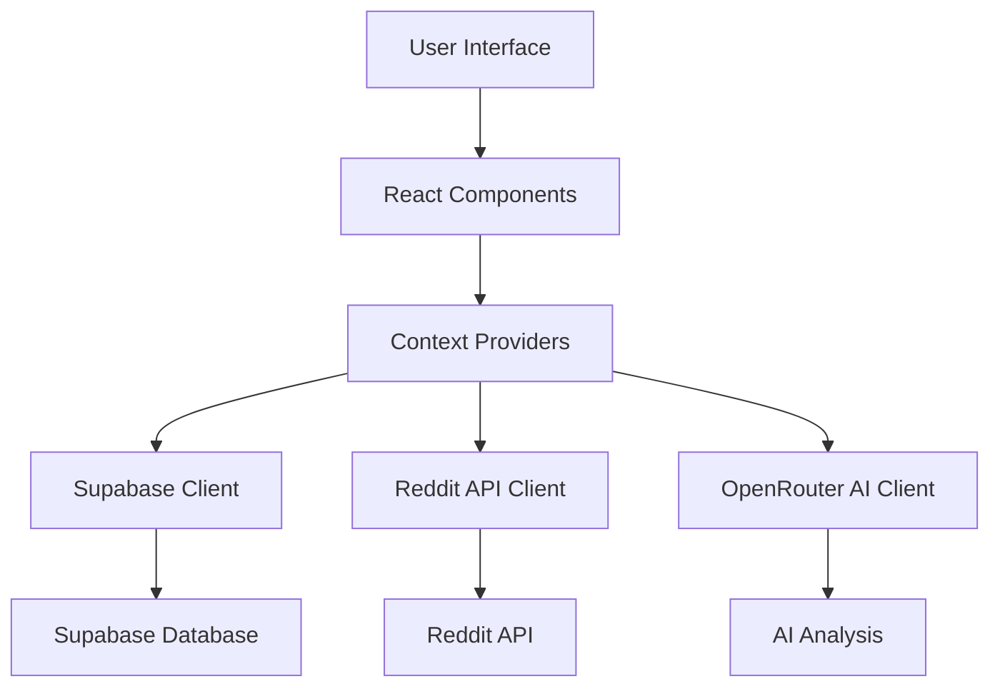
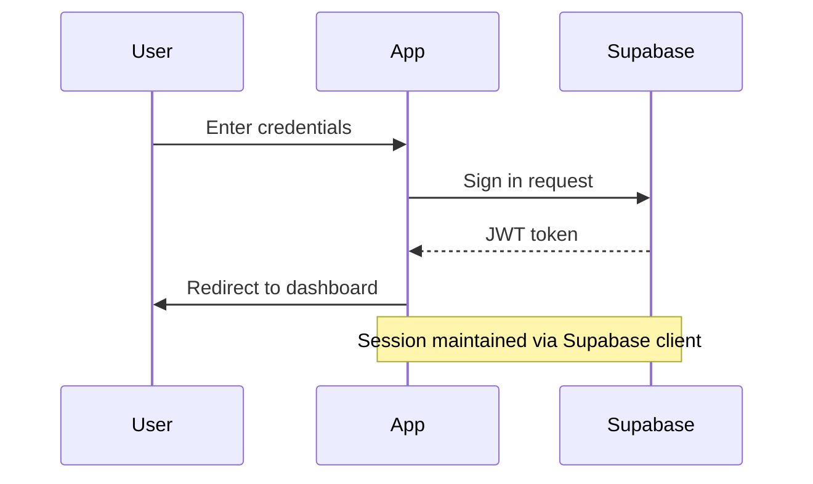
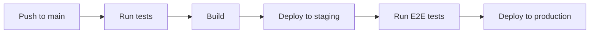

# SubPirate Documentation

## Table of Contents
1. [Overview](#overview)
2. [Architecture](#architecture)
3. [Features](#features)
4. [Technical Stack](#technical-stack)
5. [Authentication](#authentication)
6. [Database Schema](#database-schema)
7. [API Integration](#api-integration)
8. [Components](#components)
9. [State Management](#state-management)
10. [Deployment](#deployment)
11. [Development Guide](#development-guide)

## Overview

SubPirate is a Reddit marketing analysis tool that helps users discover, analyze, and manage marketing opportunities across different subreddits. The application provides AI-powered insights, engagement metrics, and project management features for coordinating marketing efforts across multiple subreddits.

### Key Features
- Subreddit analysis with AI-powered insights
- Project management for organizing marketing campaigns
- Team collaboration with role-based access
- Saved subreddits list for quick access
- Detailed analytics and recommendations
- Content strategy planning

## Architecture

The application follows a modern React-based architecture with the following key components:

```
src/
├── components/     # Reusable UI components
├── contexts/       # React context providers
├── lib/           # Core business logic and API integrations
├── pages/         # Main application pages/routes
└── types/         # TypeScript type definitions
```

### Data Flow


## Technical Stack

### Frontend
- React 18.3.1
- TypeScript 5.5.3
- Vite 5.4.2
- TailwindCSS 3.4.1
- Lucide React (icons)

### Backend
- Supabase (Database & Auth)
- OpenRouter AI API
- Reddit API

### Development Tools
- ESLint
- PostCSS
- Autoprefixer

## Authentication

Authentication is handled through Supabase Auth with the following features:

- Email/Password authentication
- Session management
- Protected routes
- Role-based access control

### Auth Flow


## Database Schema

### Core Tables

#### profiles
- `id` (uuid, PK) - References auth.users
- `display_name` (text)
- `created_at` (timestamptz)
- `updated_at` (timestamptz)

#### projects
- `id` (uuid, PK)
- `user_id` (uuid, FK)
- `name` (text)
- `description` (text)
- `image_url` (text)
- `created_at` (timestamptz)
- `updated_at` (timestamptz)

#### project_members
- `id` (uuid, PK)
- `project_id` (uuid, FK)
- `user_id` (uuid, FK)
- `role` (enum: 'read', 'edit', 'owner')
- `created_at` (timestamptz)
- `updated_at` (timestamptz)

#### subreddits
- `id` (uuid, PK)
- `name` (text)
- `subscriber_count` (integer)
- `active_users` (integer)
- `marketing_friendly_score` (integer)
- `posting_requirements` (jsonb)
- `posting_frequency` (jsonb)
- `allowed_content` (text[])
- `best_practices` (text[])
- `rules_summary` (text)
- `title_template` (text)
- `last_analyzed_at` (timestamptz)
- `created_at` (timestamptz)
- `updated_at` (timestamptz)

#### project_subreddits
- `id` (uuid, PK)
- `project_id` (uuid, FK)
- `subreddit_id` (uuid, FK)
- `created_at` (timestamptz)

#### saved_subreddits
- `id` (uuid, PK)
- `user_id` (uuid, FK)
- `subreddit_id` (uuid, FK)
- `created_at` (timestamptz)
- `last_post_at` (timestamptz)

### Row Level Security (RLS)

All tables have RLS enabled with the following policies:

#### Projects
```sql
-- View own projects
CREATE POLICY "view_own_projects"
  ON projects FOR SELECT
  TO authenticated
  USING (user_id = auth.uid());

-- Create projects
CREATE POLICY "create_projects"
  ON projects FOR INSERT
  TO authenticated
  WITH CHECK (user_id = auth.uid());

-- Update own projects
CREATE POLICY "update_own_projects"
  ON projects FOR UPDATE
  TO authenticated
  USING (user_id = auth.uid());

-- Delete own projects
CREATE POLICY "delete_own_projects"
  ON projects FOR DELETE
  TO authenticated
  USING (user_id = auth.uid());
```

#### Project Members
```sql
-- View project members
CREATE POLICY "view_project_members"
  ON project_members FOR SELECT
  TO authenticated
  USING (
    EXISTS (
      SELECT 1 FROM projects
      WHERE id = project_members.project_id
      AND user_id = auth.uid()
    )
  );

-- Manage project members
CREATE POLICY "manage_project_members"
  ON project_members FOR ALL
  TO authenticated
  USING (
    EXISTS (
      SELECT 1 FROM projects
      WHERE id = project_members.project_id
      AND user_id = auth.uid()
    )
  );
```

## API Integration

### Reddit API
The application uses a custom Reddit API client (`src/lib/redditApi.ts`) that handles:
- Authentication with Reddit's API
- Rate limiting and retries
- Error handling
- Data transformation

Key endpoints used:
- `/r/{subreddit}/about.json` - Subreddit information
- `/r/{subreddit}/hot.json` - Hot posts
- `/r/{subreddit}/about/rules.json` - Subreddit rules
- `/subreddits/search.json` - Subreddit search

### OpenRouter AI
AI analysis is performed using the OpenRouter API (`src/lib/openRouter.ts`):
- Model: deepseek/deepseek-chat
- Custom system prompts for marketing analysis
- Structured output format
- Error handling and retries

## Components

### Core Components
- `Modal` - Base modal component
- `ProgressBar` - Progress indicator
- `Logo` - Application logo
- `Sidebar` - Navigation sidebar

### Feature Components
- `ShareProjectModal` - Project sharing interface
- `ProjectSettingsModal` - Project settings management
- `AddToProjectModal` - Add subreddits to projects
- `SubredditAnalysis` - Subreddit analysis display

## State Management

The application uses React Context for state management:

### AuthContext
```typescript
interface AuthContextType {
  user: User | null;
  loading: boolean;
  signIn: (email: string, password: string) => Promise<void>;
  signUp: (email: string, password: string) => Promise<void>;
  signOut: () => Promise<void>;
  updateProfile: (data: { display_name?: string }) => Promise<void>;
}
```

## Development Guide

### Environment Setup
Required environment variables:
```bash
VITE_SUPABASE_URL=your_supabase_url
VITE_SUPABASE_ANON_KEY=your_supabase_anon_key
VITE_REDDIT_CLIENT_ID=your_reddit_client_id
VITE_REDDIT_CLIENT_SECRET=your_reddit_client_secret
```

### Local Development
1. Clone the repository
2. Install dependencies: `npm install`
3. Start development server: `npm run dev`
4. Run tests: `npm test`
5. Build for production: `npm run build`

### Code Style
- Follow TypeScript best practices
- Use functional components with hooks
- Implement proper error handling
- Write meaningful comments
- Use consistent naming conventions

### Testing
- Unit tests for utility functions
- Component tests with React Testing Library
- Integration tests for API clients
- End-to-end tests for critical flows

### Performance Considerations
- Implement proper memoization
- Use lazy loading for routes
- Optimize image loading
- Cache API responses
- Use proper indexing in database

### Security Best Practices
- Implement proper input validation
- Use prepared statements for SQL
- Follow OWASP guidelines
- Regular security audits
- Keep dependencies updated

## Deployment

The application can be deployed to any static hosting service:

1. Build the application:
```bash
npm run build
```

2. Deploy the `dist` directory

3. Configure environment variables

4. Set up proper CORS and security headers

### CI/CD Pipeline


## Contributing

1. Fork the repository
2. Create a feature branch
3. Make your changes
4. Write/update tests
5. Submit a pull request

### Pull Request Guidelines
- Follow the PR template
- Include tests
- Update documentation
- Follow code style guidelines
- Ensure CI passes

## Support

For technical support:
1. Check the documentation
2. Search existing issues
3. Create a new issue if needed
4. Contact support team

## License

This project is proprietary and confidential.
All rights reserved.