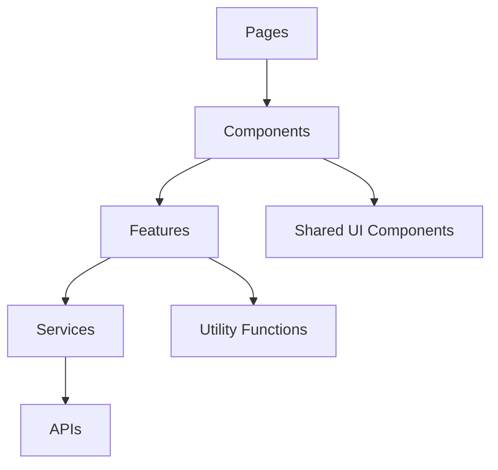
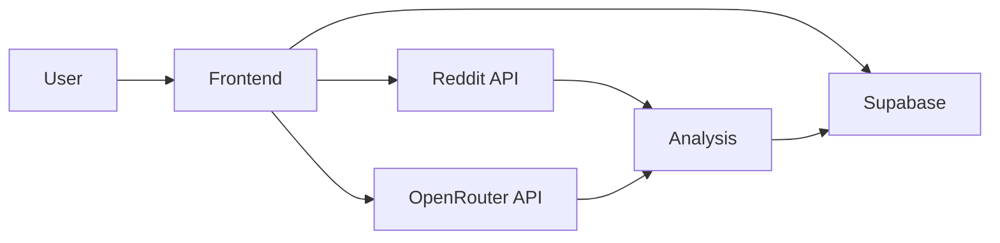

# System Patterns

## Architecture Overview

### Frontend Architecture


### Data Flow


## Component Structure

### Core Components
1. **Analysis Components**
   - SubredditAnalysis
   - AnalysisCard
   - ProgressBar
   - ContentTypeIndicators

2. **Project Components**
   - ProjectList
   - ProjectSubreddits
   - ProjectSettings
   - ShareProject

3. **Shared Components**
   - SavedList
   - AddToProject
   - FilterSort
   - Icons

## Design Patterns

### 1. Component Patterns
- Presentational/Container separation
- Compound components for complex UIs
- Render props for flexible components
- Custom hooks for shared logic

### 2. State Management
- React Query for API data
- Local state for UI elements
- Supabase realtime for sync
- Context for theme/auth

### 3. Error Handling
- Boundary components
- Graceful degradation
- User-friendly messages
- Detailed logging

### 4. Performance Patterns
- Code splitting
- Lazy loading
- Memoization
- Debounced API calls

## Technical Decisions

### 1. Framework Choices
- **React**: Component-based UI
- **TypeScript**: Type safety
- **Tailwind**: Styling
- **Supabase**: Backend

### 2. API Integration
- **Reddit API**: Direct REST calls
- **OpenRouter**: AI analysis
- **Supabase**: Real-time data

### 3. Data Storage
- **Supabase Tables**:
  - projects
  - subreddits
  - project_subreddits
  - saved_subreddits
  - user_settings

### 4. Authentication
- Supabase Auth
- JWT tokens
- Role-based access

## Code Organization

### Directory Structure
```
src/
├── components/
│   ├── analysis/
│   ├── project/
│   └── shared/
├── features/
│   ├── subreddit-analysis/
│   └── project-management/
├── lib/
│   ├── api/
│   ├── utils/
│   └── hooks/
├── pages/
└── styles/
```

### Feature Organization
- Services
- Components
- Types
- Utils
- Hooks

## Implementation Guidelines

### 1. Component Guidelines
- Single responsibility
- Prop type definitions
- Error boundaries
- Loading states

### 2. State Management
- Minimize prop drilling
- Centralize API logic
- Cache management
- Optimistic updates

### 3. Styling Approach
- Tailwind utilities
- CSS variables
- Responsive design
- Dark theme

### 4. Testing Strategy
- Unit tests for utils
- Component testing
- Integration tests
- E2E workflows 