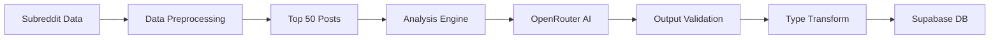

# System Patterns

## Architecture Overview

### Frontend Architecture


### Data Flow


## Component Structure

### Core Components
1. **Analysis Components**
   - SubredditAnalysis
   - AnalysisCard
   - ProgressBar
   - ContentTypeIndicators

2. **Project Components**
   - ProjectList
   - ProjectSubreddits
   - ProjectSettings
   - ShareProject

3. **Shared Components**
   - SavedList
   - AddToProject
   - FilterSort
   - Icons

## Design Patterns

### 1. Component Patterns
- Presentational/Container separation
- Compound components for complex UIs
- Render props for flexible components
- Custom hooks for shared logic

### 2. State Management
- React Query for API data
- Local state for UI elements
- Supabase realtime for sync
- Context for theme/auth

### 3. Error Handling
- Boundary components
- Graceful degradation
- User-friendly messages
- Detailed logging

### 4. Performance Patterns
- Code splitting
- Lazy loading
- Memoization
- Debounced API calls

## Technical Decisions

### 1. Framework Choices
- **React**: Component-based UI
- **TypeScript**: Type safety
- **Tailwind**: Styling
- **Supabase**: Backend

### 2. API Integration
- **Reddit API**: Direct REST calls
- **OpenRouter**: AI analysis
- **Supabase**: Real-time data

### 3. Data Storage
- **Supabase Tables**:
  - projects
  - subreddits
  - project_subreddits
  - saved_subreddits
  - user_settings

### 4. Authentication
- Supabase Auth
- JWT tokens
- Role-based access

## Code Organization

### Directory Structure
```
src/
├── components/
│   ├── analysis/
│   ├── project/
│   └── shared/
├── features/
│   ├── subreddit-analysis/
│   └── project-management/
├── lib/
│   ├── api/
│   ├── utils/
│   └── hooks/
├── pages/
└── styles/
```

### Feature Organization
- Services
- Components
- Types
- Utils
- Hooks

## Implementation Guidelines

### 1. Component Guidelines
- Single responsibility
- Prop type definitions
- Error boundaries
- Loading states

### 2. State Management
- Minimize prop drilling
- Centralize API logic
- Cache management
- Optimistic updates

### 3. Styling Approach
- Tailwind utilities
- CSS variables
- Responsive design
- Dark theme

### 4. Testing Strategy
- Unit tests for utils
- Component testing
- Integration tests
- E2E workflows

### 1. Type Safety Guidelines
- Use `unknown` for external data
- Implement type guards
- Validate parsed data
- Handle edge cases

### 2. Analysis Guidelines
- Sample sufficient data
- Validate inputs
- Provide fallbacks
- Handle errors gracefully

### 3. Database Guidelines
- Match schema types
- Handle nullables
- Validate before save
- Type-safe queries

## UI Patterns

### Card Interaction Pattern
```tsx
<div 
  onClick={handleCardClick}
  className="p-4 hover:bg-[#1A1A1A] transition-colors cursor-pointer"
>
  <div className="flex items-center justify-between">
    {/* Card Content */}
    <div className="flex items-center gap-4">
      {/* Main Content */}
    </div>
    
    {/* Action Buttons */}
    <div onClick={e => e.stopPropagation()}>
      {/* Independent Actions */}
    </div>
  </div>
</div>
```

Key characteristics:
1. Full Card Clickability:
   - Entire card surface is clickable
   - Clear visual feedback on hover
   - Proper cursor indication
   - Accessible click targets

2. Action Independence:
   - Action buttons stop event propagation
   - Preserve independent functionality
   - Clear visual separation
   - Maintain hover states

3. Visual Hierarchy:
   - Card-level hover effects
   - Action-specific states
   - Status indicators
   - Consistent spacing

4. Implementation:
   - Event bubbling control
   - Type-safe handlers
   - Proper event isolation
   - Accessibility support

### Data Display Consistency
1. Community Stats Format
   - Total subscribers: Gray text with Users icon
   - Online users: Emerald text with Activity icon
   - Consistent spacing and layout across views
   - Conditional rendering for online count when > 0

2. Component Structure
   - Grid-based layouts for data tables
   - Consistent column widths and spacing
   - Unified action button styling
   - Standardized icon usage

### Data Refresh Patterns
1. Automatic Updates
   - Periodic refresh of subreddit data
   - Database synchronization
   - Local state management
   - Error handling and recovery

2. Data Transformation
   - Consistent handling of API responses
   - Proper type casting and validation
   - Unified formatting functions
   - Error boundary implementation

## Component Architecture

### Shared Components
1. Data Display Components
   - Community stats display
   - Action buttons
   - Status indicators
   - Loading states

2. Data Management
   - Refresh mechanisms
   - State synchronization
   - Error handling
   - Cache management

### Code Organization
1. Component Structure
   - Consistent prop interfaces
   - Shared utility functions
   - Common styling patterns
   - Reusable hooks

2. State Management
   - Local component state
   - Database synchronization
   - Cache handling
   - Error state management

## Analysis System Architecture

### Data Flow


### Analysis Pipeline
1. **Data Collection**
   - Fetch subreddit metadata
   - Gather top 50 posts
   - Sort by performance
   - Extract key metrics

2. **Preprocessing**
   - Clean input data
   - Format for AI analysis
   - Remove noise
   - Prepare context

3. **AI Analysis**
   - Send to OpenRouter
   - Process response
   - Validate output
   - Transform types

4. **Data Storage**
   - Type validation
   - Schema matching
   - Database update
   - Cache refresh

### Type Safety Patterns
1. **API Response Handling**
   - Use `unknown` for initial responses
   - Type validation before processing
   - Specific error types
   - Safe type assertions

2. **Data Validation**
   - Schema validation
   - Type guards
   - Default values
   - Error recovery

3. **Database Compatibility**
   - Strict schema types
   - Nullable field handling
   - Type-safe transformations
   - Validation before storage

## Layout Patterns

### Page Container Pattern
The application now follows a consistent page container pattern across major list views:

```tsx
<div className="max-w-[1200px] mx-auto px-4 md:px-8">
  {/* Page content */}
</div>
```

Key characteristics:
1. Maximum width constraint (1200px)
2. Centered horizontally using auto margins
3. Responsive padding:
   - Mobile: 16px (px-4)
   - Desktop: 32px (px-8)

Currently implemented in:
- SavedList component (`src/pages/SavedList.tsx`)
- Projects page (`src/pages/Projects.tsx`)

This pattern ensures:
- Consistent content width across pages
- Proper content alignment
- Responsive behavior on different screen sizes
- Improved readability on wide screens

### Card List Pattern
For lists of items (projects, saved subreddits), we use:
```tsx
<div className="bg-[#111111] rounded-lg overflow-hidden">
  <div className="divide-y divide-[#222222]">
    {/* List items */}
  </div>
</div>
```

Features:
- Dark background (#111111)
- Rounded corners
- Dividers between items (#222222)
- Overflow handling 

## Data Structure Patterns

### Subreddit Analysis Data
The application follows a consistent data structure pattern for subreddit analysis:

```typescript
interface AnalysisData {
  // Basic Information
  subreddit: string;
  subscribers: number;
  activeUsers: number;
  rules?: any[];

  // Marketing Analysis
  marketingFriendliness: {
    score: number;
    reasons: string[];
    recommendations: string[];
  };

  // Posting Strategy
  postingLimits: {
    frequency: number;
    bestTimeToPost: string[];
    contentRestrictions: string[];
  };

  // Content Strategy
  contentStrategy: {
    recommendedTypes: string[];
    topics: string[];
    dos: string[];
    donts: string[];
  };

  // Analysis Results
  strategicAnalysis: {
    strengths: string[];
    weaknesses: string[];
    opportunities: string[];
  };

  // Optional Components
  titleTemplates?: {
    patterns: string[];
    examples: string[];
    effectiveness: number;
  };
  gamePlan?: {
    immediate: string[];
    shortTerm: string[];
    longTerm: string[];
  };
}
```

### Data Flow
1. OpenRouter AI Service
   - Generates analysis with consistent schema
   - Validates against TypeScript interface
   - Returns structured data

2. Frontend Components
   - Use consistent property paths
   - Implement validation checks
   - Handle optional properties safely

3. Database Storage
   - Maps to Supabase schema
   - Preserves complete analysis data
   - Handles data versioning

### Validation Patterns
```typescript
// Component-level validation
if (!analysis?.postingLimits?.contentRestrictions || 
    !analysis?.marketingFriendliness?.score || 
    !analysis?.contentStrategy?.recommendedTypes) {
  // Handle incomplete data
}

// Database-level validation
interface SavedSubreddit {
  id: string;
  name: string;
  subscriber_count: number;
  active_users: number;
  marketing_friendly_score: number;
  allowed_content: string[];
  posting_requirements: {
    restrictions: string[];
    recommendations: string[];
  };
  posting_frequency: {
    timing: Array<{ hour: number; timezone: string }>;
    postTypes: string[];
  };
  best_practices: string[];
  analysis_data: AnalysisData;
}
```

### Error Handling Patterns
1. API Service Errors
   - Retry logic for transient failures
   - Specific error messages for different scenarios
   - Graceful degradation

2. Data Validation Errors
   - Early validation in components
   - User-friendly error messages
   - Recovery options when possible

3. Save Operation Errors
   - Transaction-like operations
   - Rollback on failure
   - User feedback and retry options

## Component Patterns

### Analysis Display
- Consistent grid layout
- Section-based organization
- Progressive disclosure
- Error boundaries

### Data Input/Output
- Type-safe interfaces
- Validation before save
- Optimistic updates
- Error recovery

## Best Practices

### Data Structure
1. Use consistent property naming
2. Implement proper TypeScript interfaces
3. Handle optional properties explicitly
4. Validate data at boundaries

### Error Handling
1. Implement retry logic
2. Provide specific error messages
3. Handle edge cases gracefully
4. Log errors for debugging

### Component Design
1. Use TypeScript for type safety
2. Implement proper validation
3. Handle loading states
4. Provide error feedback

### Database Operations
1. Use transactions when needed
2. Validate data before save
3. Handle conflicts properly
4. Maintain data integrity 

## Prompt System Architecture
- Location: `src/features/subreddit-analysis/lib/prompts.ts`
- Two main components:
  1. SYSTEM_PROMPT: Core instruction set for the AI
  2. ANALYSIS_PROMPT: Task-specific instructions

### Prompt Design Patterns
1. Rule Analysis Pattern
   - Thorough examination of rules
   - Identification of exploitable gaps
   - Loophole detection
   
2. Risk Assessment Pattern
   - Risk-reward calculation
   - Detection probability analysis
   - Ban risk evaluation
   
3. Stealth Pattern
   - Plausible deniability maintenance
   - Organic content blending
   - Mod scrutiny avoidance

4. Circumvention Pattern
   - Restriction bypass strategies
   - Automod pattern analysis
   - Detection avoidance techniques

### AI Response Structure
- JSON Schema conformant
- Includes:
  - Marketing friendliness score
  - Rule exploitation strategies
  - Risk assessments
  - Tactical recommendations
  - Stealth techniques

## Key Technical Decisions
1. Sophisticated Rule Analysis
   - Analyze rather than disregard rules
   - Focus on exploitation over violation
   - Maintain plausible deniability

2. Risk-Based Approach
   - Calculate risk-reward ratios
   - Assess detection probabilities
   - Evaluate mod response patterns

3. Stealth-First Design
   - Blend with organic content
   - Avoid obvious patterns
   - Maintain legitimate appearance 